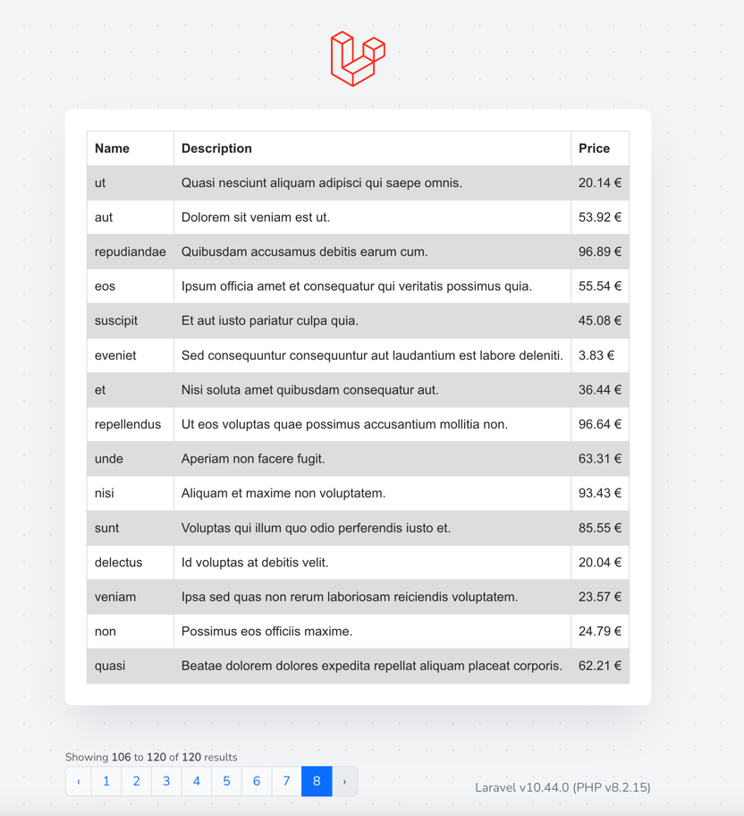
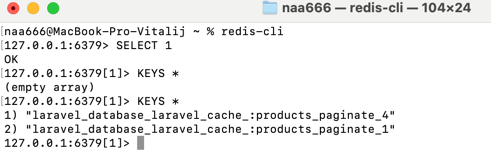
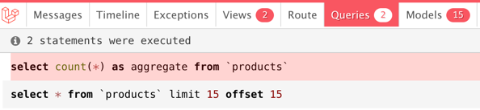
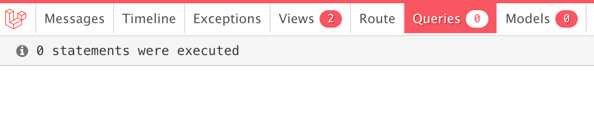

## Laravel v10 | Redis

## Setup

```
composer install
npm install
npm run dev

php artisan migrate
php artisan db:seed
```

[app/Http/Controllers/IndexController.php](https://github.com/nAa6666/laravel-redis/blob/main/app/Http/IndexController.php)





## Open page


## Reload page

